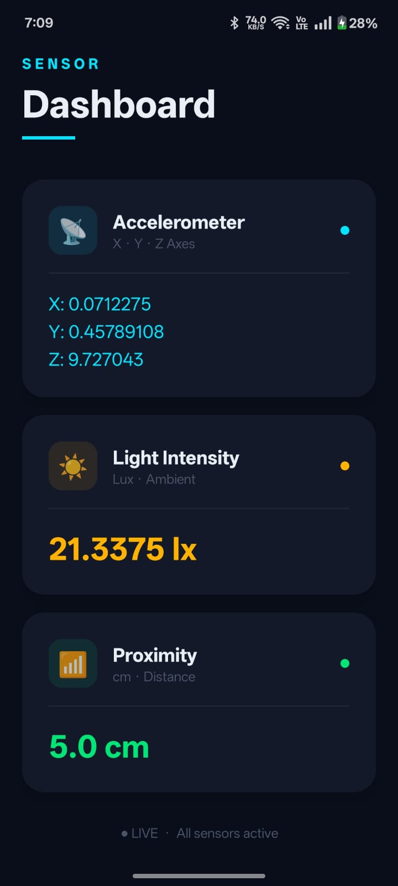

# 📡 SensorApp

A real-time Android sensor dashboard that displays live data from the device's Accelerometer, Light, and Proximity sensors.

---

## 📱 Screenshots



---

## ✨ Features

- **Accelerometer** — Displays real-time X, Y, Z axis values in m/s²
- **Light Sensor** — Shows ambient light intensity in Lux (lx)
- **Proximity Sensor** — Shows distance to nearby objects in centimetres (cm)
- **Live Updates** — All sensors update in real time using `SENSOR_DELAY_NORMAL`
- **Battery Friendly** — Sensors are unregistered automatically when the app is paused or closed
- **Modern Dark UI** — Card-based dark theme with colour-coded sensor panels

---

## 🛠️ Tech Stack

| Layer | Technology |
|---|---|
| Language | Java |
| Min SDK | API 21 (Android 5.0) |
| UI | XML Layouts + CardView |
| Sensors | Android `SensorManager` API |
| Theme | MaterialComponents (Dark) |

---

## 📂 Project Structure

```
app/
└── src/
    └── main/
        ├── java/com/mad/sensorapp/
        │   └── MainActivity.java       # Sensor logic & UI updates
        └── res/
            ├── layout/
            │   └── activity_main.xml   # Dashboard UI layout
            ├── values/
            │   ├── colors.xml          # Dark theme colour palette
            │   ├── strings.xml         # App strings
            │   └── themes.xml          # App theme (dark)
            └── drawable/
                ├── icon_bg_cyan.xml    # Accelerometer icon background
                ├── icon_bg_amber.xml   # Light sensor icon background
                ├── icon_bg_green.xml   # Proximity icon background
                ├── dot_cyan.xml        # Live indicator dot (cyan)
                ├── dot_amber.xml       # Live indicator dot (amber)
                └── dot_green.xml       # Live indicator dot (green)
```

---

## 🚀 Getting Started

### Prerequisites

- Android Studio (latest version recommended)
- Android device or emulator running API 21+
- Physical device recommended for accurate sensor readings

### Installation

1. Clone or download this repository
2. Open the project in **Android Studio**
3. Let Gradle sync complete
4. Connect your Android device (USB debugging enabled) or start an emulator
5. Click **Run ▶** or press `Shift + F10`

### Dependency

Make sure your `build.gradle (Module: app)` includes:

```gradle
dependencies {
    implementation 'androidx.cardview:cardview:1.0.0'
}
```

---

## ⚙️ How It Works

`MainActivity.java` implements `SensorEventListener` and listens to three sensors:

```
onResume()  → registerListener()   // Start reading sensors
onPause()   → unregisterListener() // Stop to save battery
onSensorChanged() → update TextViews with live values
```

| Sensor | Android Constant | Output |
|---|---|---|
| Accelerometer | `Sensor.TYPE_ACCELEROMETER` | X, Y, Z in m/s² |
| Light | `Sensor.TYPE_LIGHT` | Lux value |
| Proximity | `Sensor.TYPE_PROXIMITY` | Distance in cm |

---

## 🎨 UI Colour Palette

| Colour | Hex | Used For |
|---|---|---|
| Background | `#0A0E1A` | App background |
| Card | `#131929` | Sensor cards |
| Cyan | `#00E5FF` | Accelerometer |
| Amber | `#FFB300` | Light sensor |
| Green | `#00E676` | Proximity sensor |

---

## 📋 Notes

- On **emulators**, sensor values may be simulated or unavailable. Use a real device for accurate readings.
- The proximity sensor on most phones only returns two values: `0 cm` (near) and a max value (far).
- Light sensor readings vary significantly depending on environment and device hardware.

---

## 👨‍💻 Author

**[Aryan Bhati]**   

---

## 📄 License

This project is for educational purposes only.
