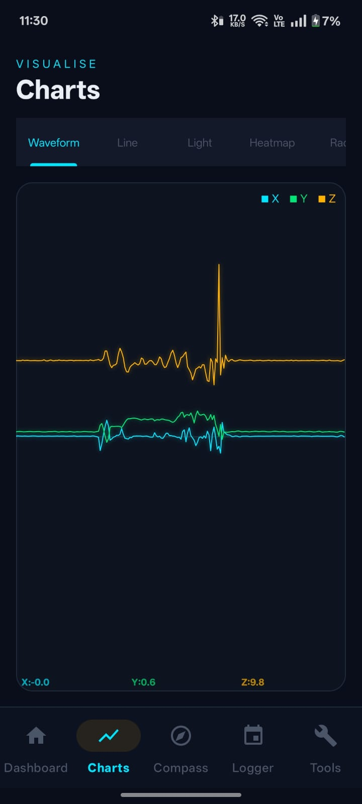
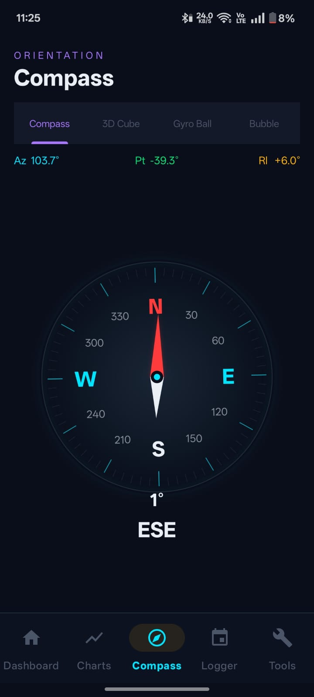
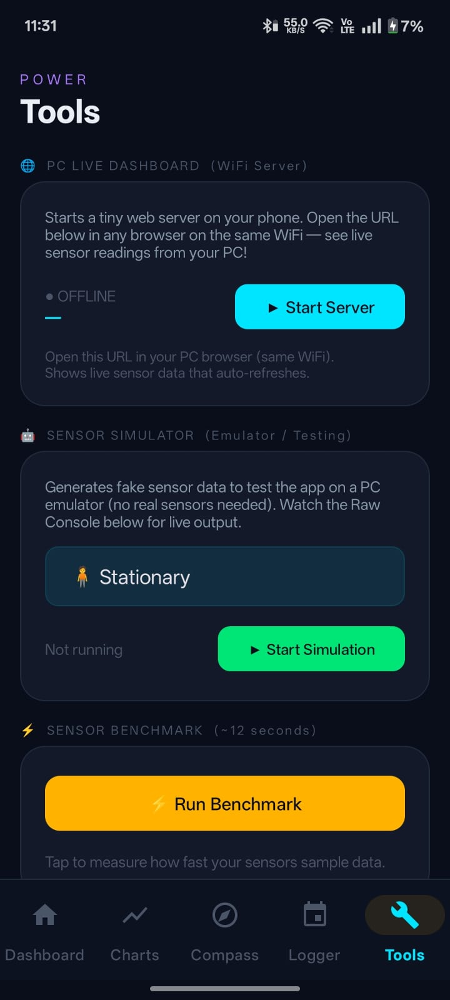
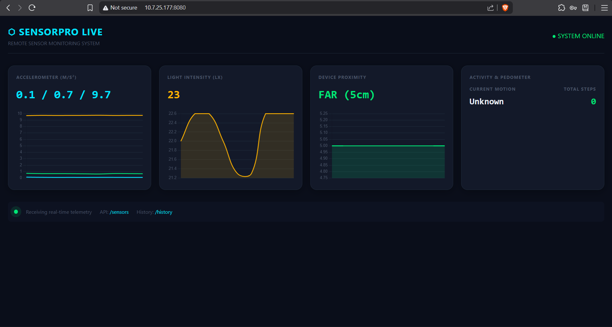

# 🚀 Sensor Analytics App (SensorPro)

> Transforming smartphones into **real-time sensor intelligence systems**

<p align="center">
  
  
  
  
  
</p>

---

## 📸 Preview

| Dashboard | Charts | Compass |
|----------|--------|--------|
|  |  |  |

| Tools | PC Live Dashboard |
|------|------------------|
|  |  |
---

## 🧠 What is this?

**SensorPro** is a **professional-grade Android application** that turns your device into a powerful **sensor analytics platform**.

It goes beyond simple sensor readings by combining:

* 📊 Real-time monitoring
* 📈 Advanced analytics
* 🎨 Custom visualizations
* 🤖 Intelligent detection systems

---

## ⚡ Core Capabilities

### 📊 Real-Time Sensor Engine

* Live dashboard with accelerometer, light & proximity
* Continuous high-frequency sensor streaming
* Real-time statistics (min / max / avg)

---

### 📈 Data Analytics & Intelligence

* FFT-based frequency analysis (signal processing)
* Activity recognition (motion classification)
* Gesture & shake detection
* Fall detection system
* Anomaly detection engine

---

### 🎨 Advanced Visualizations

* Custom Canvas-based rendering engine
* Heatmaps, waveform graphs, gauge meters
* 3D orientation cube & physics-based UI elements
* Interactive charts (MPAndroidChart)

---

### 🔄 Background & Automation

* Foreground services for continuous tracking
* Scheduled recording via WorkManager
* Floating HUD overlay across apps

---

### 🌐 Connectivity & Integration

* Built-in HTTP server → live PC dashboard
* CSV export & PDF report generation
* Bluetooth-based data sharing

---

## 🏗️ Architecture Overview

Designed using a **modular layered architecture**:

```text
data     → persistence (Room DB, models)
service  → background processing & workers
server   → networking & REST endpoints
ui       → fragments & navigation
utils    → analytics (FFT, ML logic, detection)
views    → custom rendering (Canvas-based)
```

---

## 🚀 Evolution

### 🔥 v2.0 — Advanced Platform

* Complete architectural redesign
* Modular system implementation
* Advanced analytics engine
* Visualization framework
* Background services & automation

### 🟢 v1.0 — Foundation

* Basic sensor dashboard
* Real-time sensor readings
* Simple UI

---

## 🛠️ Tech Stack

| Category     | Tech                    |
| ------------ | ----------------------- |
| Language     | Java                    |
| UI           | XML + Material Design   |
| Architecture | Modular (MVVM-inspired) |
| Database     | Room                    |
| Charts       | MPAndroidChart          |
| Background   | WorkManager             |
| Networking   | Java HTTP Server        |

---

## 🎯 Why this project stands out

✔ Real-world problem solving (sensor analytics)
✔ Advanced concepts (signal processing, detection systems)
✔ Custom rendering (Canvas-based UI)
✔ Modular scalable architecture
✔ 40+ integrated features

---

## 🚀 Getting Started

```bash
git clone https://github.com/AryanBhati02/Sensor-Analytics-App
```

Open in Android Studio → Run on a real device.

---

## 📌 Future Improvements

* Cloud sync (Firebase)
* AI-based anomaly detection
* WearOS integration
* Cross-device analytics dashboard

---

## 👨‍💻 Author

**Aryan Bhati**

---

## 📄 License

MIT License
